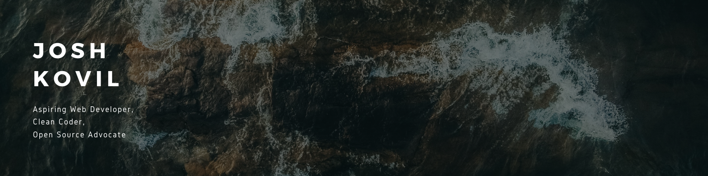

    

# **Hello there!**

Just a developer with a passion for creating accessible, personalised, and open web experiences for all. Currently, I'm working as a QA Analyst/Engineer at [HUGE](https://www.hugeinc.com), that focuses on transforming designs into functional products and services. If you want to know more about me, my work, and my experiences, head on over to ~~joshkovil.com~~.

## 🔧 **Technologies & Tools**

<!-- add all custom badges here -->

## 🤝🏾 **Connect With Me**

<!-- Social media flatcon here (Linkedin, Instagram, Twitter)-->

    
    Linkedin Page

    
    Instagram Stories

    
    Twitter Feed

